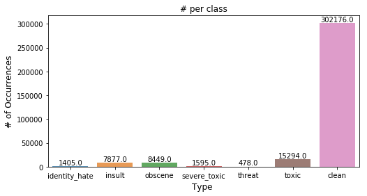

# 机器学习纳米学位
## 毕业项目 
马远超
2019-07-01

## I. 问题定义
### 项目概述
互联网的本质是为了降低人们获取信息的成本，更便捷的进行沟通和分享。因此，从互联网创建时，就允许世界各地的人们通过互联网进行自由的交流、讨论以及合作。而像国内的贴吧，微博，微信，国外的Twitter，Facebook，Wikipedia等社区平台的建立，形成了这些互动可以发生的基础。为了人们在社区中可以更有序的交流以及促进对话，许多的社区都制定了自己的标准和规则，并防止这些社区被有毒行为劫持或摧毁。然而，随着有毒评论的黑色产业化，利益驱使人们通过各种手段来规避规范和标准，使得通过人为来执行这些规范和标准变得越来越困难。事实上Facebook正在招聘越来越多的版主来筛选可疑的内容[1]。同时，许多新闻网站现在也已经开始禁用评论功能[2]。而这些人工的审核监控机制，是非常低效的做法。

综上，我们需要一种工具来自动化地对用户评论进行监视，分类和标记。此外，不同的网站可能需要监控不同类型的内容。因此需要建立一个能够区分不同类型的言语攻击行为的模型。

我们可以看到在论文[3]中，研究人员对情感分析进行了大量研究。他们的工作重点是情绪分析，这与我们正在研究的领域非常相似。论文中定义了一种使用词袋技术预处理文本的合理方法。他们接着使用SVM和朴素贝叶斯分类器来确定推文的情绪是积极的，中性的还是负面的，并且发现朴素贝叶斯分类器更准确。此外，当他们对推文进行矢量化时，他们通过使用bigrams来提高分类器的准确性。他们的工作可以为我的benchmark model参考。

### 问题陈述
Toxic Comment Classification Challenge是kaggle上由Jigsaw提出的一个比赛，比赛中提供了带有多标签分类的Wikipedia评论数据，我们通过使用这份数据训练一个**文本多类型分类器**，对任意未知文本进行多标签类型（威胁，色情，侮辱和种族歧视言论等）的分类，并给出文本分别属于每个分类的概率。**这是一个文本多分类问题，并属于有监督学习**。

### 评价指标
我使用列平均的ROC AUC作为我的评估指标，它是单个类别预测结果ROC AUC的平均值。ROC曲线是在不同分类阈值下使用TPR和FRP绘制的图，而AUC则是ROC曲线下面积，当AUC值越大，当前的分类算法越有可能将正样本排在负样本前面，即能够更好的分类[7]。

ROC空间将假阳性率（FPR）定义为X轴，真阳性率（TPR）定义为Y轴[8]。
* TPR：真阳性率，在所有实际为阳性的样本中，被正确地判断为阳性之比率。
$$TPR=\frac{TP}{(TP+FN)}$$
* FPR：假阳性率在所有实际为阴性的样本中，被错误地判断为阳性之比率。
$$FPR=\frac{FP}{(FP+TN)}$$
将同一模型每个阈值的(FPR, TPR)座标都画在ROC空间里，就成为特定模型的ROC曲线。

AUC为ROC曲线下方的面积（Area under the Curve of ROC），它表示当随机抽取一个阳性样本和一个阴性样本，分类器正确判断阳性样本的值高于阴性样本的概率（假设阈值以上是阳性，以下是阴性）。简单说来说AUC值越大的分类器，正确率越高。

从AUC判断分类器（预测模型）优劣的标准：
* AUC = 1，是完美分类器，采用这个预测模型时，存在至少一个阈值能得出完美预测。绝大多数预测的场合，不存在完美分类器。
* 0.5 < AUC < 1，优于随机猜测。这个分类器（模型）妥善设定阈值的话，能有预测价值。
* AUC = 0.5，跟随机猜测一样（例：丢铜板），模型没有预测价值。
* AUC < 0.5，比随机猜测还差；但只要总是反预测而行，就优于随机猜测。

同时，偏差，方差，精度，召回和F1分数也将用作评估指标，以检查过度拟合和欠拟合。

## II. 分析
### 数据探索
训练数据由Toxic Comment Classification Challenge比赛提供。数据为对恶性行为人工标注的Wikipedia评论数据，每个样本有可能被同时标注为多个类型，当所有类型的标注都为0时，表示该文本不是恶毒评论。标注的类型包括：
* toxic
* severe_toxic
* obscene
* threat
* insult
* identity_hate

比赛提供的数据由如下四个文件构成：
* train.csv - 训练集，包括159571条已进行标注的评论数据
* test.csv - 测试集，包括153164条待检测数据

csv文件的数据格式为：
* id
* comment_text
* toxic
* severe_toxic
* obscene
* threat
* insult
* identity_hate

其中，comment_text是模型的输入。toxic，severe_toxic，obscene，threat，insult，identity_hate，如之前所诉为样本的分类标签，样本有可能同时属于多个分类。模型的输出是输入文本被**分别**判断为每个分类（toxic，insult等）的概率。

同时，在训练集中，评论人工标注类型标签的个数分布如下图[4]，由图可见该数据集是一个非平衡的数据集。

下图显示了训练集中每条评论的单词数。正如我们所看到的，大多数评论都有0到100个单词。去重后单词数小于或等于100的评论占比为97%。

### 探索性可视化

### 算法和技术
这个问题可以通过使用一种算法来解决，该算法将评论作为输入并输出一个概率列表，无论它是否有毒和毒性类型。文本分类最常用和简单的基线模型是朴素贝叶斯分类器和支持向量机。

**朴素贝叶斯分类器**是一个基于贝叶斯规则的线性分类器：

$$P(w_j|X_i) = \frac{P(X_i|w_j) \cdot P(w_j)}{P(X_i)}$$

后验概率$P(w_j|X_i)$可以被描述为输入属于类的概率，给定输入的特征和特征的条件概率（如果它们属于特定类）。朴素贝叶斯分类器还假设每个特征独立于其他特征。

它们通过找出单词$x$属于某个类的概率来识别给定一组单词$(w_1..w_n)$的类$P(w_j|X_i)$的概率$w$对于数据集$P(X_i|w_j)$中的每个单词，并将其乘以类的概率$P(w_j)$并将其除以单词出现的概率$P(X_i)$然后最大化这种后验概率。

**支持向量机**是一种监督学习模型，可用于分类和回归。 SVM将每个输入样本映射为空间中的点，并构造超平面或超平面集，以便每个类的样本除以明确的间隙。然后将新样本映射到空间中并基于平面之间的间隙预测属于特定类。

结合NB和SVM分类器并且工作得相当好的算法是NBSVM[10]，它将用作基线模型。

为了解决这个问题，我们也可以使用神经网络。神经网络是一层互连的节点，其中包含类似于人类大脑神经元的激活功能。神经网络通过输入层接收输入作为数字，并将输入传递给处理它的隐藏层。隐藏层可以是多个层。每层中的每个节点都有一个权重，节点将输入与权重相乘以得到输出。然后输出层提供单个数字，该数字基于激活函数提供概率或类。通过为每个节点分配随机权重来训练网络，并且网络自动调整权重以使预测接近实际输出。

在我们的例子中，网络的输入是转换成数字形式的文本，其中每个单词输入到节点，输出层包含6个节点，表示6个输出类型的概率。

然而，这些模型和其他反馈模型（如CNN）的问题是它们不跟踪顺序数据，即它们不跟踪句子中单词的上下文，并且它们对于长文本表现不佳和它们倾向于过度训练数据。

为了克服这个问题，我使用了递归神经网络（RNN）。在递归神经网络中，每个节点具有反馈回路，该回路在给定时间步长处获取先前输入。这允许RNN展示时间序列的时间动态行为。 RNN具有短期存储器，允许其基于节点的权重和先前的输入决策来确定当前输入。如下所示，反馈环路使用前n个输入序列的输入处理输入。

长短期记忆网络[11]是一种回归神经网络算法，是一种专为自然语言处理而设计的算法，经证明可以很好地运行，并且可以作为解决方案的基础。LSTM网络克服了传统RNN无法从长时间运行的顺序数据中获取上下文信息的缺点，它可以记住长时间的重要信息。

LSTM单元如下所示。每个单元有3个门：输入门，输出门和遗忘门。门由S形和矢量运算表示。输入门决定需要在单元状态中存储哪些新信息。遗忘门如果不重要则删除旧信息，输出门使输入影响当前时间步的输出。每个门都是一个输出在0和1之间的sigmoid层，其中0表示不通过，1表示让一切通过。

LSTM单元有3个输入：输入样本$x$在$t$时刻$(x_t)$，前一个LSTM单元格的记忆$(C_{t-1})$，前一个LSTM单元格的输出$(h_{t-1})$，

LSTM单元完成的步骤：
1. 前一个单元格的输出和当前输入通过遗忘层忘记旧信息。
2. 下一层节点决定需要在单元状态中存储哪些新信息。这是通过识别要更新的值并创建新值的向量来完成的。
3. 接下来，通过将单元状态与步骤1（遗忘向量）和步骤2（新值）的输出相乘，来将旧单元得状态更新为新单元状态。
4. 然后，将输入和新记忆相乘以得到输出。

有一种LSTM的形式称为双向LSTM，其具有两个网络，一个用于正常文本序列，一个用于反向序列文本。此外，在LSTM层之后使用卷积神经网络层，其从网络中提取局部特征。

在将数据输入到网络之前，需要对文本数据进行预处理（分词等）。另外，我们还需要将文本数据转换为数字形式，其中每个单词由数字表示。然后，该数值数据用于将每个评论转换为具有向量表示（one-hot编码）。然而，one-hot编码这种向量表现形式是稀疏且低效的。为了克服这一点，常将每个单词表示为词嵌入向量，并且，具有相似含义的单词的词嵌入向量将具有相似的表示。

**词嵌入**

要将文本数据提供给神经网络模型训练，我们需要将它们标记为数字的形式，最常见形式为one-hot编码。但是它用来表示词向量时候，非常的稀疏且低效。
为了克服这个问题，向量空间模型被创建出来。在向量空间中，每个单词可以用一个稠密的向量来表示，且空间中距离相近的单词会有相似的语义。 向量空间模型依赖于分布假设，该假设指出出现在相同上下文中的单词具有相似含义。
遵循这一原则的两种方法是：
1. 基于频率的嵌入 - 查找数据集中每个单词的频率，为每个单词创建密集向量。
2. 基于预测的嵌入 - 使用神经网络，根据给定词汇表中每个单词的上下文创建词嵌入。

我正在进行基于预测的嵌入，因为它更加密集和高效，并且有预先训练好的字嵌入，例如Google和stanford的GloVe[12]和Facebook的FastText [13][14][15]。

具体来说，我选择了FastText作为预训练的单词嵌入，因为它的表现平均比GloVe更好（尽管不是很大）。Fasttext基于word2vec，其中每个单词使用n-gram分成子单词，最终的嵌入向量将是所有n-gram的向量之和。

FastText的词嵌入模型使用的是skip-gram，并使用Common Crawl数据集进行模型的训练。该数据集包含6000亿个令牌并包含200万个单词向量。

完成嵌入模型后，定义模型并将数据拟合到模型中，并使用测试数据测试模型。

总结一下：
1. 数据探索。会对训练数据集中的平均分类进行分布统计，并创建可视化图形。此外，还可以创建词云图，以了解每个类别中的常用词。同时，了解数据集中的独特单词，常出现单词，填充单词等，对于数据集的理解也很重要。
2. 预处理数据。例如空值处理，异常处理处理等。在预处理期间，需要删除所有不需要的数据。这包括可能包含随机字母或单词的垃圾数据，非文本数据，用户名等。预处理措施一般包括：
    * 大写变小写
    * 去掉停顿词，标点，空白文本，英文之外的其他文本
    * 分词
    * 词性标注 - 帮助我们更好的理解单词/句子的含义
    * 词干提取 - 减少输入的语料库
    * 生成文档矩阵后计算tf-idf，去除频率较低的单词（例如去掉频率小于5的，或去掉在60%文档中出现的单词）
3. 使用词嵌入创建数据的向量表示
4. 定义模型并定义模型的各个层。我定义的模型以词嵌入向量作为输入，接着是LSTM层和CNN层。输出层使用sigmoid作为激活函数。
5. 使用AUROC作为度量标准来训练和测试模型。

### 基准模型
SVM是最常用的文本分类算法之一，可用作基准模型。基于SVM和朴素贝叶斯算法的SVMNB[6]，它提供了比传统SVM更好的性能，是在kaggle比赛中的推荐的benchmark，我将使用SVMNB作为我的benchmark model。

## III. 方法
### 数据预处理
Jigsaw提供的维基媒体评论数据大多是干净的，没有任何空值。但正如上一节所述，数据存在类不平衡问题。大多数数据都很干净，甚至在有毒数据中也有一些类别。但是，选择的度量标准AUROC不受此类不平衡问题的影响。

在数据集上完成的预处理步骤是：
1. 识别并处理数据集中的所有空值 - 数据集不会包含任何空值。
2. 删除数据集中的特殊字符和数字 - 它们没有贡献模型的任何内容，使用简单的正则表达式删除。这也需要处理表情符号，IP地址等。
3. 将所有文本转换为小写并将每个评论拆分为单词组成的数组。
4. 从文本中删除停顿词 - 停顿词是像a，to等词。这些单词不提供任何上下文信息，不需要添加到模型中。
5. 使用提取的词干替代单词 - 词干提取，即删除任何前缀和后缀，减少了词汇空间。
6. 评论被修剪和填充到100个单词的统一长度 - 每个评论可能具有不同的长度，需要将其归一化。因为神经网络期望每个评论具有相同数量的特征。这里长度选择为100，是因为如数据探索部分（图2）所示，大多数注释包含少于100个单词。

这些预处理步骤显著减小了输入的大小。

完成此操作后，需要将文本数据编码为数值。使用词嵌入稠密的向量表示。如前所述，选择FastText预训练嵌入作为嵌入层。
### 执行过程
模型描述：
   1. 输入层接受长度为100的单词索引列表（如在上一节中所述，每个注释都被转换为长度为100的向量）。

    input = Input(shape=(maxlen,)) # maxlen=100

   2. 网络的第一层是嵌入层。嵌入层接收包含整数序列作为输入的字向量，并基于权重将这些整数转换为密集向量。权重由fastText提供。该层的输出是尺寸为300的可训练特征向量（嵌入向量维数） 

    `x = Embedding(max_features, embed_size, weights=[embedding_matrix])(input)`
    # max_features = 20000（词汇表的大小，即数据集中最常见的20k），embed_size = 300（fastText预训练矢量维度）

   3. 添加丢失层用于正则化以避免过度拟合并且添加空间丢失，因为相邻矢量是相关的并且被推荐在第一层之后。空间丢失会丢弃整个特征向量（单词的嵌入表示）。

    x = SpatialDropout1D(0.2)(x)

   4. 下一层是LSTM层，使用双向LSTM层[16]。双向lstm层可以通过训练2个LSTM来获取过去和未来状态的信息，一个在正常输入序列上，另一个在输入序列的反向副本上。双向LSTM显示出比正常LSTM更快收敛和更好的性能[17]。网络大小根据试验和错误定义为120。
   
    x = Bidirectional(LSTM(120, return_sequences=True,name='lstm_layer'))(x)

   5. 下一层是1D CNN层，内核大小为3，显示出比简单的LSTM模型更好[18]。
   
    x = Conv1D(60, kernel_size = 3, padding = "valid", kernel_initializer = "he_uniform")(x)

   6. 下一层是池化层，它是全局最大池和全局平均池的组合，并将输入数据减少到1d向量。
   
    avg_pool = GlobalAveragePooling1D()(x) 
    max_pool = GlobalMaxPooling1D()(x)
    x = concatenate([avg_pool, max_pool])

   7. 下一层是dropout层
   
    x = Dropout(0.2)(x)

   8. 输出层有6个节点，并应用sigmoid函数来获得6个输出标签的预测。

使用二元交叉熵作为损失函数，以及adam算法来训练模型。模型实现的代码很简单，代码通过查看keras和scikit-learn文档来完成，其中包含用于实现模型，度量，交叉验证和嵌入的详细文档。环境使用的是Udacity中的GPU训练环。
### 完善
该模型最初是一个简单的LSTM模型，没有使用嵌入向量，没有使用预处理方法，AUROC达到了96.7%。

对模型优化步骤如下：
1. 完成数据预处理，包括删除符号和数字，用词干替换单词，删除单词；
2. 尝试了几个word2vec库，例如gloVe和fastText，在对比准确率和AUROC指标的情况下，在最终模型中选择了fastText。
3. 限制输入向量的长度为100。
4. 输入bidirectional层设置120个单元，cnn层设置60个filter，步长为3，添加空间dropout层和全局dropout层，dropout=0.2。这些值是通过对各种输入参数重复训练模型来确定的，会在下一节中介绍。
5. 数据在128k样本上进行训练，并在32k样本上进行验证。测试数据包含64k样本。训练在2个epoch后完成，批量大小为1280。使用更多的epoch会导致过拟合，训练损失和验证损失之间的差异增加。
6. 模型使用k折交叉验证进行交叉验证（k=10），在以下参数集合中选择最佳的参数：lstm的cell大小（30,60,90,120），cnn层filter（30,60），cnn步长（2,3）和dropout（0.1,0.2,0.3）。

| Model                                        | AUROC  |
| :------------------------------------------- | :----- |
| LSTM without embedding & preprocessing       | 0.9515 |
| LSTM without embedding & with preprocessing  | 0.9570 |
| LSTM with gloVe embedding & preprocessing    | 0.9531 |
| LSTM with fastText embedding & preprocessing | 0.9721 |

最终模型的AUROC得分为97.70％，远优于基准模型，得分为73.9％

## IV. 结果
### 模型的评价与验证
下面给出了各种度量的模型测试结果：
|           | Toxic  | Severely Toxic | Obscene | Threat | Insult | Identity Hate | Overall |
| :-------- | :----- | :------------- | :------ | :----- | :----- | :------------ | :------ |
| AUROC     | 0.9563 | 0.9856         | 0.9707  | 0.9814 | 0.9618 | 0.9768        | 0.9721  |
| Accuracy  | 0.9155 | 0.9927         | 0.9553  | 0.9962 | 0.9525 | 0.9900        | 0.8698  |
| Precision | 0.9381 | 0.9931         | 0.9618  | 0.9961 | 0.9592 | 0.9897        | 0.5464  |
| Recall    | 0.9155 | 0.9927         | 0.9553  | 0.9962 | 0.9524 | 0.9900        | 0.7459  |
| F1 Score  | 0.9232 | 0.9929         | 0.9578  | 0.9961 | 0.9553 | 0.9899        | 0.6283  |

前6列表示每个label的指标。最后一列表示所有标签的加权平均值。基于子集精度的多标签分类的sklearn指标，其匹配每个标签的精确标签。这导致精确度，f1得分，精确度和召回率显着降低。但是，个别分类成绩仍然很高。

模型使用k-fold交叉验证验证模型，k=10。

在k-fold交叉验证中，原始样本被随机分成k份相等大小的子样本。在k个子样本中，保留1个子样本作为用于测试模型的验证数据，并且剩余的k-1个子样本用作训练数据。然后将交叉验证过程重复k次，其中每k个子样本仅使用一次作为验证数据。然后可以对k个结果求平均以产生单个估计。该方法优于重复随机子采样的优点是所有观察都用于训练和验证，并且每个观察仅用于验证一次。

下图显示了各种参数k = 10倍的训练和验证准确度和损失。

- Mean of validation loss : 0.058834951277546656
- Variance of validation loss : 0.00012065656784282981
- Mean of validation accuracy : 0.9801671659953083
- Variance of validation accuracy : 9.68356868005733e-06

- Mean of validation loss : 0.05706344353535009
- Variance of validation loss : 5.0135825168220734e-05
- Mean of validation accuracy : 0.9804300261667311
- Variance of validation accuracy : 8.413672602476248e-06

- Mean of validation loss : 0.05613930753644884
- Variance of validation loss : 4.228854554445845e-05
- Mean of validation accuracy : 0.9811872583656547
- Variance of validation accuracy : 1.4784551311087157e-06

- Mean of validation loss : 0.05417640228897693
- Variance of validation loss : 2.7418915412924683e-05
- Mean of validation accuracy : 0.9815063959056527
- Variance of validation accuracy : 7.306275900144301e-07

根据以上数据，最终模型参数的选择为：lstm=120，cnn=60,3，dropout=0.3。但是，最后两个模型在每个指标中都非常接近。

### 合理性分析
最终的模型得分比基准模型好得多。然而，它没有比未经优化的简单lstm模型好多少。
||Bechmark Model|Final Model|
|:---|:---|:---|
|AUROC|0.7621|0.9721|
|Accuracy|0.8813|0.8698|
|Precision|0.6276|0.5464|
|Recall|0.6578|0.7459|
|F1 score|0.6337|0.6283|

与验证数据相比，最终模型要好得多。最终模型的AUROC评分为0.97。此外，每个预测大约需要10-30毫秒，这非常快，因此该模型可以在浏览器插件中实时使用，用于实时对评论进行验证和过滤。

## V. 项目结论
### 对项目的思考
在进行该项目的过程中学习到了很多，可总结如下：
1. 学会用公共数据集来处理相关的问题
2. 数据的预处理
3. 了解了可用于解决特定问题的各种可能的处理方案和模型
4. 设计benchmark，及其作用
5. 基于对各种模型的评估，设计了模型的最终架构
6. 用数据训练模型
7. 使用词嵌入优化模型

另外，我借此机会使用经过实践验证的预处理技术以及较新的word2vec技术，不仅可以标记文本，还可以尝试让我们的模型推断出单词和短语的重要性。我们还尝试使用一些sklearn以及keras的算法包来构建我们的模型。

经过这个项目，激发了我对NLP和情感分析领域的研究的兴趣，另外，全世界也有许多个人和团队正在使用一些经典和新技术来解决各种各样的NLP问题。深度神经网络，词嵌入向量，bert等预处理技术都给NLP领域带来了很大的发展。

项目中最难的部分是尝试开发有效的自动化处理流程。在整个项目中，由于时间的的限制，我没有实践尝试开发更有效的处理流程。例如，通过使用并发可以显着加快一些预处理步骤，但是jupyter notebook并不支持并发。

最终，我的模型确实符合我对问题解决方案的期望。该模型能否应该用于更一般的环境？模型是否有更好的泛化能力？是否有可能提高模型的准确性？这些问题都待我后续思考和解决。

### 需要做出的改进
在解决这个问题时，我发现有几个方面可以改进。
1. 使用网格搜索，更系统的构建网络并执行超参数调整。我们认为我们的CNN和RNN在解决我们的问题方面具有更大的潜力，并且通过使用网格搜索技术和更多访问支持GPU的机器，我们可以极大地提高模型的性能。
2. 可以使用Attention技术，BERT预处理等技术来优化模型。
3. 模型仅使用维基百科的有限数据进行训练。可以增加更多数据来源和语言类型来对模型进行训练。

### Reference
1. http://fortune.com/2018/03/22/human-moderators-facebook-youtube-twitter/
2. https://www.theguardian.com/science/brain-flapping/2014/sep/12/comment-sections-toxic-moderation
3. http://crowdsourcing-class.org/assignments/downloads/pak-paroubek.pdf
4. https://github.com/udacity/cn-machine-learning/blob/master/toxic-comment-classification/pics/hist.png
5. https://www.researchgate.net/profile/Sepp_Hochreiter/publication/13853244_Long_Short-term_Memory/links/5700e75608aea6b7746a0624/Long-Short-term-Memory.pdf
6. https://nlp.stanford.edu/pubs/sidaw12_simple_sentiment.pdf
7. http://alexkong.net/2013/06/introduction-to-auc-and-roc/
8. https://zh.wikipedia.org/wiki/ROC%E6%9B%B2%E7%BA%BF
9. https://github.com/Kirupakaran/Toxic-comments-classification/blob/master/proposal.pdf
10. [Baselines and Bigrams](https://nlp.stanford.edu/pubs/sidaw12_simple_sentiment.pdf)
11. [Long Short Term Memory](https://www.researchgate.net/publication/13853244_Long_Short-term_Memory)
12. [gloVe](https://nlp.stanford.edu/projects/glove/)
13. [Enriching Word Vectors with Subword Information](https://arxiv.org/abs/1607.04606)
14. [Advances in Pre-Training Distributed Word Representations](https://arxiv.org/abs/1712.09405)
15. [fastText](https://fasttext.cc/)
16. [Bidirectional Recurrent Neural Networks](https://maxwell.ict.griffith.edu.au/spl/publications/papers/ieeesp97_schuster.pdf)
17. [Framewise Phoneme Classification with Bidirectional LSTM and Other Neural Network Architectures](ftp://ftp.idsia.ch/pub/juergen/nn_2005.pdf)
18. [Twitter Sentiment Analysis using combined LSTM-CNN Models](https://www.academia.edu/35947062/Twitter_Sentiment_Analysis_using_combined_LSTM-CNN_Models)